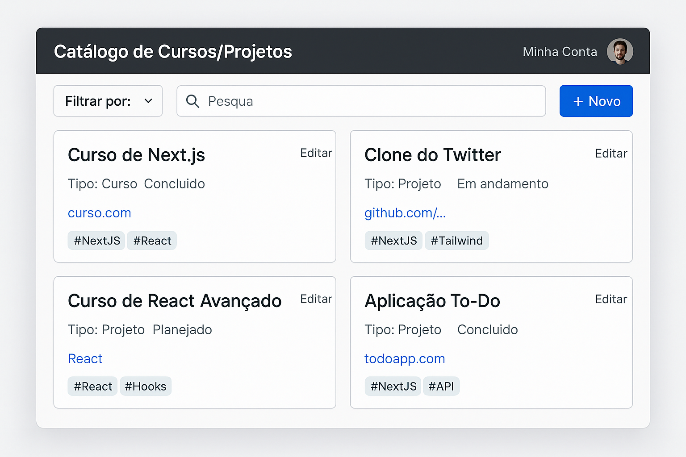

### 🎯 **`DevCatalog`** — Um catálogo pessoal para cursos e projetos de desenvolvimento.

---

### 📌 Objetivo da Aplicação

Criação de uma aplicação fullstack com **ReactJS (via Vite)** que permita ao usuário:

* Cadastrar cursos e projetos que esteja estudando ou desenvolvendo
* Visualizar todos os itens cadastrados
* Filtrar por tipo (curso/projeto), status, tags
* Editar ou remover um item
* Autenticar-se com login (opcional nesta fase inicial)

---

### 🧱 Estrutura inicial das entidades

**Tabela (coleção)** para os itens do catálogo com os seguintes campos:

#### 📘 Modelo `Entry`

| Campo       | Tipo      | Descrição                         |
| ----------- | --------- | --------------------------------- |
| `id`        | string    | Identificador único (MongoDB ID)  |
| `titulo`    | string    | Nome do curso ou projeto          |
| `descricao` | string    | Descrição opcional                |
| `tipo`      | string    | "curso" ou "projeto"              |
| `status`    | string    | "em andamento", "concluído", etc. |
| `tags`      | string\[] | Palavras-chave                    |
| `link`      | string    | Link para o projeto ou curso      |
| `createdAt` | date      | Data de criação                   |

---

### 🗂️ Páginas da aplicação (MVP)

* `/` → Dashboard com listagem e filtros
* `/novo` → Formulário para adicionar novo item
* `/editar/:id` → Editar item existente
* `/login` (opcional por enquanto)

---

### 🛠️ Stack confirmada

| Parte    | Ferramenta              |
| -------- | ----------------------- |
| Frontend | ReactJS (Vite)          |
| Estilo   | TailwindCSS             |
| Backend  | Express.js (futuro)     |
| Banco    | MongoDB (MongoDB Atlas) |
| Auth     | Nenhuma (por enquanto)  |

---

### 📘 Protótipo da aplicação

